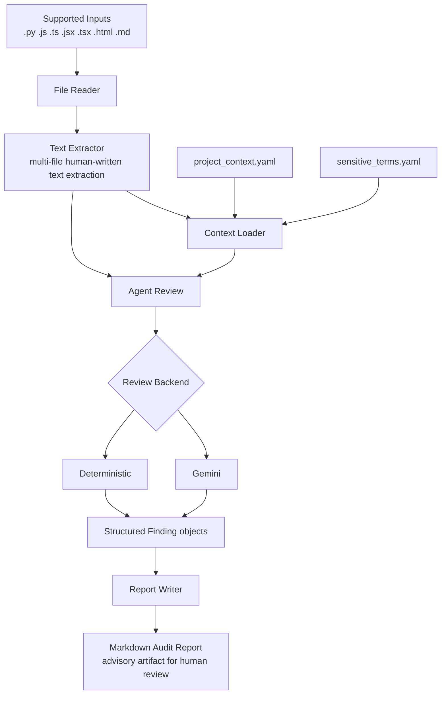

# Semantic Compliance Review Agent

An AI-assisted CLI agent that reviews human-written source code text for
security, compliance, professionalism, and internal-information risks.

The current implementation is intentionally narrow:

- one file in
- one Markdown audit report out
- human review required

It is designed for the Google x Kaggle AI Agents capstone as a practical,
explainable agent workflow rather than an autonomous code-modification system.

## Project Pitch

Developers often leave risky human-written text inside source files:

- TODO notes that mention credentials or shortcuts
- docstrings that expose internal project names
- comments that are unprofessional or misleading
- text that traditional static analysis tools usually ignore

This project extracts reviewable text, adds project context, sends it through
an ADK-backed review boundary, and produces a structured Markdown audit report
for human review.

## Architecture Diagram



## Key Concepts Demonstrated

### ADK Agent Architecture

The project uses an ADK-backed review boundary to turn extracted human-written
text plus project context into structured findings. The architecture stays
narrow and explainable: one file in, one structured review, one report out,
across Python, JavaScript-family, HTML, and Markdown files.

### Security Guardrails

The tool is intentionally advisory. It does not auto-edit files, auto-commit
changes, or silently switch backends when Gemini fails. Human review remains
the final decision point for any suggested remediation.

### Agent Skills / CLI Workflow

The project demonstrates a tool-like agent workflow through explicit CLI stages:
file reading, text extraction, context loading, agent review, and report
writing. This keeps the system easy to demo, easy to trace, and honest about
what is and is not automated.

## What The Agent Does Today

Current implemented workflow:

1. Read one source file.
2. Fail clearly if the file type is unsupported.
3. Extract reviewable text from supported source types.
4. Load review context from YAML config files.
5. Run semantic review through the agent boundary.
6. Write one audit report to `output/`.

Current supported extraction scope:

- Python files:
  comments, docstrings, TODO / FIXME / NOTE comments
- JavaScript-family files (`.js`, `.ts`, `.jsx`, `.tsx`):
  `//` comments, `/* */` block comments, `/** */` JSDoc blocks, and
  TODO / FIXME / NOTE comments
- HTML files (`.html`):
  `<!-- -->` comments, including TODO / FIXME / NOTE HTML comments
- Markdown files (`.md`):
  headings, paragraphs, list items, and blockquotes

If the input file type is unsupported, the CLI fails clearly and no audit is
performed.

Approved extraction design for the implemented MVP file types:

- `.js`, `.ts`, `.jsx`, and `.tsx` via JavaScript-style comments only
- `.html` via HTML comments only
- `.md` via headings, paragraphs, list items, and blockquotes

Implemented now:

- JavaScript-family extraction for `.js`, `.ts`, `.jsx`, and `.tsx`
- HTML comment extraction for `.html`
- Markdown prose-block extraction for `.md`

Current review outputs:

- structured findings
- finding severity
- finding confidence
- detection method
- recommendation text
- optional suggested replacement text
- Markdown audit report

## Current Limitations

The current implementation does not yet provide:

- repository-wide scanning
- automatic source modification
- clean-copy generation
- evaluation harness
- web UI
- database
- authentication
- multi-agent architecture

Important scope truth:

Current extraction support includes Python, JavaScript-family comments, HTML
comments, and Markdown prose blocks.

Required before final submission:

- `.py`
- `.js`
- `.ts`
- `.jsx`
- `.tsx`
- `.html`
- `.md`

Potential later expansion:

- `.yaml` / `.yml`
- `.json`
- `Dockerfile`
- Terraform files

Those broader file types are roadmap items, not current runtime behavior.

## Quickstart

### 1. Install Dependencies

```text
python -m venv .venv
.venv\Scripts\activate
pip install -r requirements.txt
```

### 2. Configure Gemini for the Default Backend

Set one of these environment variables:

- `GOOGLE_API_KEY`
- `GEMINI_API_KEY`

Example PowerShell session:

```text
$env:GOOGLE_API_KEY="your-key-here"
```

Gemini is the default backend.

If Gemini is selected and no credentials are available, the CLI fails clearly.
It does not silently fall back to deterministic mode.

### 3. Run the Agent

Default Gemini run:

```text
python -m src.main examples/sample_input.py
```

Deterministic offline/test run:

```text
python -m src.main examples/sample_input.py --backend deterministic
```

JavaScript-family deterministic test run:

```text
python -m src.main examples/sample_input.js --backend deterministic
```

HTML deterministic test run:

```text
python -m src.main examples/sample_input.html --backend deterministic
```

Markdown deterministic test run:

```text
python -m src.main examples/sample_input.md --backend deterministic
```

## Example Behavior

Current sample input:

- `examples/sample_input.py`
- `examples/sample_input.js`
- `examples/sample_input.html`
- `examples/sample_input.md`

Generated report location:

- `output/sample_input-audit-report.md`

Typical console flow:

```text
File read successfully
Path: examples/sample_input.py
Backend: Deterministic
Reviewable text items found: 6
Context loaded successfully
Sensitive terms loaded: 3
Findings generated: 1
Report written to: output/sample_input-audit-report.md
```

The exact findings may differ between Gemini and deterministic mode.

Unsupported file example:

```text
Text extraction failed: Unsupported file type '.json' for semantic review. Current supported file types: .py, .js, .ts, .jsx, .tsx, .html, .md. No audit was performed.
```

## Backends

### Gemini

Default backend.

Purpose:

- real semantic review path
- capstone demonstration path

Requirements:

- `GOOGLE_API_KEY` or `GEMINI_API_KEY`

Failure behavior:

- fail clearly on missing credentials
- fail clearly on provider/runtime errors
- no silent fallback

### Deterministic

Explicit offline/test backend.

Purpose:

- predictable local verification
- documentation and report checks without live credentials

This backend is useful for development and demos where a stable local output is
more valuable than live semantic variation.

## Architecture Overview

Current runtime flow:

```text
User
-> CLI
-> File Reader
-> Text Extractor
-> Context Loader
-> Agent Review
-> Report Writer
-> Markdown Audit Report + Console Summary
```

Current major components:

- `src/file_reader.py`
- `src/text_extractor.py`
- `src/context_loader.py`
- `src/agent_review.py`
- `src/report_writer.py`
- `src/main.py`

## Security and Safety Model

The project is intentionally advisory.

Current guardrails:

- no automatic source modification
- no automatic commits
- no silent Gemini fallback
- human review required
- suggested replacements are advisory only
- reports are audit artifacts, not automatic fixes
- API keys must come from environment variables

See:

- `docs/security-guardrails.md`

## Project Structure

```text
semantic-compliance-review-agent/
  README.md
  AGENTS.md
  requirements.txt
  specs/
    project-plan-v4.txt
  docs/
    architecture.md
    build-log.md
    decisions.md
    security-guardrails.md
    evaluation-plan.md
    course-concepts.md
    codex-workflow.md
  config/
    sensitive_terms.yaml
    project_context.yaml
  examples/
    sample_input.py
    sample_input.js
    sample_input.html
    sample_input.md
    sample-audit-report.md
  output/
    sample_input-audit-report.md
  evaluation/
    __init__.py
    README.md
    cases/
    expected/
    results/
  src/
    main.py
    file_reader.py
    text_extractor.py
    extractors/
      __init__.py
      javascript_extractor.py
      html_extractor.py
      markdown_extractor.py
    context_loader.py
    agent_review.py
    report_writer.py
    schemas.py
    adk_spike.py
```

## Current Status

Current phase:

- Phase 8B.1 - Evaluation Foundation

Most recently completed:

- Phase 8B.1 - Evaluation Foundation

Implemented through Phase 6.96C and documented through Phase 8B.1:

- repository foundation
- ADK feasibility spike
- file reading
- Python text extraction
- context loading
- ADK-backed review boundary
- Gemini backend
- deterministic backend
- Markdown report generation
- report readability and presentation polish
- runtime cleanup and fail-clear unsupported-file behavior
- JavaScript-family extraction for `.js`, `.ts`, `.jsx`, and `.tsx`
- HTML comment extraction for `.html`
- Markdown prose-block extraction for `.md`
- submission-readiness documentation and reviewer-facing project framing
- approved evaluation design for repeatable Phase 8 implementation
- evaluation package and directory foundation

Not implemented yet:

- clean-copy generation
- evaluation harness
- evaluation cases and expected outputs
- evaluation results

## Roadmap Before Submission

Expected next phases:

1. Phase 8B.2 - Dataset and Expected Outputs
2. Phase 8B.3 - Deterministic Runner and Metrics
3. Phase 8B.4 - Gemini Evaluation Snapshot
4. Phase 9 - Final Documentation

Highest-priority gaps before submission:

- implement clean-copy generation with guardrails
- implement evaluation with hand-built cases and expected results
- keep the end-to-end demo stable and reproducible
- finish the final writeup and short demo video package

## Documentation Guide

Key docs:

- `specs/project-plan-v4.txt`
- `docs/architecture.md`
- `docs/build-log.md`
- `docs/decisions.md`
- `docs/security-guardrails.md`
- `docs/evaluation-plan.md`
- `docs/course-concepts.md`
- `docs/codex-workflow.md`

## Development Notes

This repository follows a documentation-sync workflow: non-trivial work should
update relevant docs in the same task.

This project is being developed as a capstone demonstration of AI-agent
architecture, structured semantic review workflows, and human-in-the-loop
software governance.
