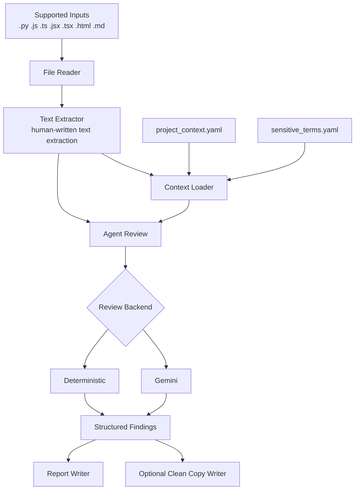

# Semantic Compliance Review Agent

An AI-assisted CLI agent that reviews human-written source code text for
security, compliance, professionalism, and internal-information risks.

The project is intentionally narrow and explainable:

- one file in
- one structured review
- one Markdown audit report out
- human review required

It is designed for the Google x Kaggle AI Agents capstone as a practical,
safety-conscious agent workflow rather than an autonomous code-modification
system.

## Project Pitch

Developers often leave risky human-written text inside source files:

- TODO notes that mention credentials or shortcuts
- docstrings that expose internal project names
- comments that are unprofessional or misleading
- prose that traditional static analysis tools usually ignore

This project extracts that reviewable text, adds project context, sends it
through an ADK-backed review boundary, and produces a structured audit report
for human review.

## What The Agent Does

Current runtime workflow:

1. Read one source file.
2. Fail clearly if the file type is unsupported.
3. Extract reviewable human-written text.
4. Load project context from YAML config files.
5. Review the extracted text through the agent boundary.
6. Optionally generate a separate clean-copy artifact.
7. Write an audit report to `output/`.

Supported extraction scope:

- `.py`: comments, docstrings, TODO / FIXME / NOTE comments
- `.js`, `.ts`, `.jsx`, `.tsx`: JavaScript-style comments only
- `.html`: HTML comments only
- `.md`: headings, paragraphs, list items, and blockquotes

If a file type is unsupported, the CLI fails clearly and does not generate an
audit report.

## Architecture Overview



The system keeps extraction, review, reporting, and optional clean-copy
generation separate. For deeper architectural detail, see
`docs/architecture.md`.

## Core Capabilities

- ADK-backed review boundary with Gemini as the default backend
- deterministic backend for repeatable offline and test runs
- structured findings with category, severity, confidence, and explanation
- committed multi-benchmark evaluation artifacts for deterministic and Gemini runs
- optional clean-copy generation behind `--clean-copy`
- conservative safety posture with no silent fallback and no original-file edits

## Backends

### Gemini

Default backend.

Use when you want the real semantic review path.

Requirements:

- `GOOGLE_API_KEY` or `GEMINI_API_KEY`

Optional model selection:

- `GEMINI_MODEL`

Default model:

- `gemini-2.5-flash`

During project evaluation, `gemini-2.5-pro` produced the most consistent
results and was therefore used for the committed Gemini evaluation snapshots
and reliability-sensitive demos:

- `gemini-2.5-pro`

### Deterministic

Explicit offline and test backend.

Use when you want predictable local verification without live credentials.

## Quickstart

### 1. Install Dependencies

PowerShell:

```text
python -m venv .venv
.venv\Scripts\activate
pip install -r requirements.txt
```

Bash:

```text
python -m venv .venv
source .venv/bin/activate
pip install -r requirements.txt
```

### 2. Configure Gemini

Set one of these environment variables:

- `GOOGLE_API_KEY`
- `GEMINI_API_KEY`

Optional:

- `GEMINI_MODEL`

PowerShell:

```text
$env:GOOGLE_API_KEY="your-key-here"
$env:GEMINI_MODEL="gemini-2.5-pro"
```

Bash:

```text
export GOOGLE_API_KEY="your-key-here"
export GEMINI_MODEL="gemini-2.5-pro"
```

If Gemini is selected and credentials are missing, the CLI fails clearly.
It does not silently fall back to deterministic mode.

### 3. Run The Agent

Default Gemini run:

```text
python -m src.main examples/sample_input.py
```

Deterministic run:

```text
python -m src.main examples/sample_input.py --backend deterministic
```

Realistic sample run:

```text
python -m src.main examples/realistic_sample.py --backend deterministic
```

Clean-copy run:

```text
python -m src.main examples/realistic_sample.py --backend deterministic --clean-copy
```

Recommended Gemini Pro demo run, PowerShell:

```text
$env:GEMINI_MODEL="gemini-2.5-pro"
python -m src.main examples/realistic_sample.py --backend gemini
```

Recommended Gemini Pro demo run, Bash:

```text
export GEMINI_MODEL="gemini-2.5-pro"
python -m src.main examples/realistic_sample.py --backend gemini
```

## Evaluation

The repository includes two committed evaluation benchmarks:

- the original 10-case benchmark under `evaluation/cases/` with matching
  expected JSON files under `evaluation/expected/`
- the repository-style benchmark under
  `evaluation/cases/repository_benchmark/` with matching expected JSON files
  under `evaluation/expected/repository_benchmark/`

Committed result artifacts include:

- `evaluation/results/deterministic-results.md`
- `evaluation/results/gemini-results.md`
- `evaluation/results/deterministic-repository_benchmark-results.md`
- `evaluation/results/gemini-repository_benchmark-results.md`

Deterministic evaluation run:

```text
python -m evaluation.run --backend deterministic
```

Deterministic repository benchmark run:

```text
python -m evaluation.run --backend deterministic --benchmark repository_benchmark
```

Gemini evaluation run:

```text
python -m evaluation.run --backend gemini --delay-seconds 15
```

Gemini repository benchmark run:

```text
python -m evaluation.run --backend gemini --benchmark repository_benchmark --delay-seconds 15
```

Recommended Gemini Pro evaluation run, PowerShell:

```text
$env:GEMINI_MODEL="gemini-2.5-pro"
python -m evaluation.run --backend gemini --delay-seconds 15
```

Recommended Gemini Pro evaluation run, Bash:

```text
export GEMINI_MODEL="gemini-2.5-pro"
python -m evaluation.run --backend gemini --delay-seconds 15
```

Benchmark selection:

- Omit `--benchmark` or use `--benchmark default` for the original top-level
  benchmark.
- Use `--benchmark <folder-name>` for a benchmark folder under
  `evaluation/cases/` with matching expected files under `evaluation/expected/`.

During execution, the runner writes incremental progress artifacts after each
completed file and retains a clearly marked partial report if the run is
interrupted:

- `*-progress.json`
- `*-partial.md`

The original 10-case dataset remains the small baseline benchmark. The
repository benchmark provides broader repository-style evaluation evidence and
supports the engineering analyses in:

- `docs/repository-benchmark/repository-benchmark-review.md`
- `docs/repository-benchmark/repository-benchmark-review-gemini.md`
- `docs/repository-benchmark/repository-benchmark-backend-comparison.md`

`examples/realistic_sample.py` is complementary usability and demo validation,
not part of the scored benchmark suite.

The committed Gemini snapshot artifact in this repository was captured with
`gemini-2.5-pro` and should be interpreted as point-in-time evaluation
snapshots rather than perfectly reproducible benchmarks.

## Clean-Copy Generation

Clean-copy generation is optional and explicit.

When `--clean-copy` is used, the tool may write:

- `output/<input-stem>-clean-copy<extension>`

Safety rules:

- the original input file is never modified
- replacements are applied only when they are exact and unambiguous
- ambiguous or missing replacements are skipped
- human review is still required before adopting any suggested wording

## Safety Guardrails

The project is intentionally advisory.

Current guardrails:

- no automatic source modification
- no silent Gemini fallback
- no automatic commits
- environment-variable credentials only
- human review required
- suggestions are advisory, not automatic fixes

## Current Limitations

The current implementation does not provide:

- repository-wide scanning
- automatic source modification
- web UI
- database
- authentication
- multi-agent architecture

Potential later expansion file types such as YAML, JSON, Dockerfile, and
Terraform are roadmap ideas, not current runtime behavior.

## Where To Go Next

- Architecture details: `docs/architecture.md`
- Evaluation design and benchmark framing: `docs/evaluation-plan.md`
- Evaluation directory usage: `evaluation/README.md`
- Security boundaries: `docs/security-guardrails.md`
- Course concept mapping: `docs/course-concepts.md`
- Durable project decisions: `docs/decisions.md`
- Historical build log: `docs/archive/build-log.md`
- Historical planning artifact: `docs/archive/development-journal.txt`
