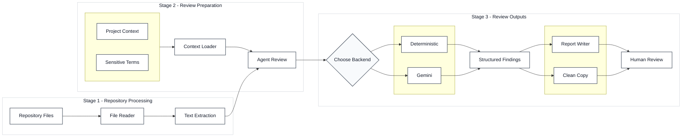

# Writeup Architecture Diagram

```mermaid
flowchart LR
    subgraph S1["Stage 1 - Repository Processing"]
        direction TB
        A[Repository Files] --> B[File Reader]
        B --> C[Text Extraction]
    end

    subgraph S2["Stage 2 - Review Preparation"]
        direction TB
        subgraph S2I[" "]
            direction LR
            E[Project Context]
            F[Sensitive Terms]
        end
        S2I --> D[Context Loader]
        D --> G[Agent Review]
    end

    subgraph S3["Stage 3 - Review Outputs"]
        direction TB
        H{Choose Backend}
        subgraph S3B[" "]
            direction LR
            I[Deterministic]
            J[Gemini]
        end
        H --> I
        H --> J
        I --> K[Structured Findings]
        J --> K
        subgraph S3O[" "]
            direction LR
            L[Report Writer]
            M[Clean Copy]
        end
        K --> L
        K --> M
        L --> N[Human Review]
        M --> N
    end

    C --> G
    G --> H

    classDef box fill:#ffffff,stroke:#4b5563,color:#111827,stroke-width:1.5px;
    classDef choice fill:#f8fafc,stroke:#4b5563,color:#111827,stroke-width:1.5px;
    classDef stage fill:#ffffff,stroke:#d1d5db,color:#111827,stroke-width:1px;

    class A,B,C,D,E,F,G,I,J,K,L,M,N box;
    class H choice;
    class S1,S2,S3 stage;
```

This is a simplified writeup version of the project architecture, derived from
the more detailed Mermaid diagram in `README.md`.
